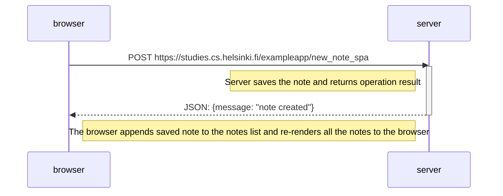

```mermaid
sequenceDiagram
    participant browser
    participant server
    
    browser->>server: POST https://studies.cs.helsinki.fi/exampleapp/new_note_spa
    activate server

    Note left of server: Server saves the note and returns operation result
    
    server-->>browser: JSON: {message: "note created"}
    deactivate server

    Note right of browser: The browser appends saved note to the notes list and re-renders all the notes to the browser
```